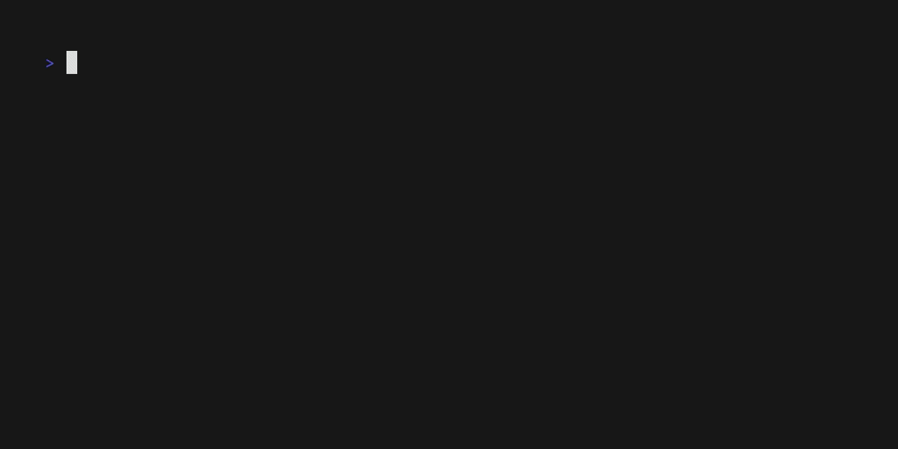

# MPRIS Lyrics
A simple Linux CLI that displays lyrics (LRC synced or plain text) from a player that supports the MPRIS protocol.

*The catch is that this one doesn't fetch lyrics from online services. It works by displaying the lyrics supplied by your player using the [`xesam:asText`](https://www.freedesktop.org/wiki/Specifications/mpris-spec/metadata/#xesam:astext) property.*

## Showcase


*Recorded using [vhs](https://github.com/charmbracelet/vhs), the tape file can be found at [`showcase.tape`](./showcase.tape).*
*The player used is a modified version of [Supersonic](https://github.com/supersonic-app/supersonic) that supports lyrics over MPRIS (hopefully will upstream it soon).*

## Installation
```bash
cargo install mpris-lyrics
```

or even better (if you have it):

```bash
cargo binstall mpris-lyrics
```

## Contributing
All types of contributions are welcome!

By contributing, you agree to license your contributions under the terms of this project's [dual license](#license).
And you agree to follow the [AI usage guidelines](#ai-usage) outlined below.

All contributions must be submitted to the [main repo](https://codeberg.org/AMA147000/mpris-lyrics).

## AI usage
For issues, discussions, etc... AI usage for translation is permitted.
But it is the responsibility of the human sender to ensure that the translation is accurate.

For code, documentation, etc... AI usage is permitted only for review and boilerplate generation (aka tab auto completion, though using it excessively is not recommended).
Also then, the human author is responsible for any bugs or issues.

This is done to ensure the project stays high quality (at least as much as I can (o_o;)), and the license remains unstained by unlicensable AI generated code.
And of course, a ton of ethical concerns (though, to be honest, you should not use it at all due to these concerns).

## License
Copyright (c) 2026 AMA

This project is licensed under either:
- MIT License (see [LICENSE-MIT](LICENSE-MIT) or [SPDX](https://spdx.org/licenses/MIT.html))
- Apache-2.0 License (see [LICENSE-Apache-2.0](LICENSE-Apache-2.0) or [SPDX](https://spdx.org/licenses/Apache-2.0.html))

at your option.
